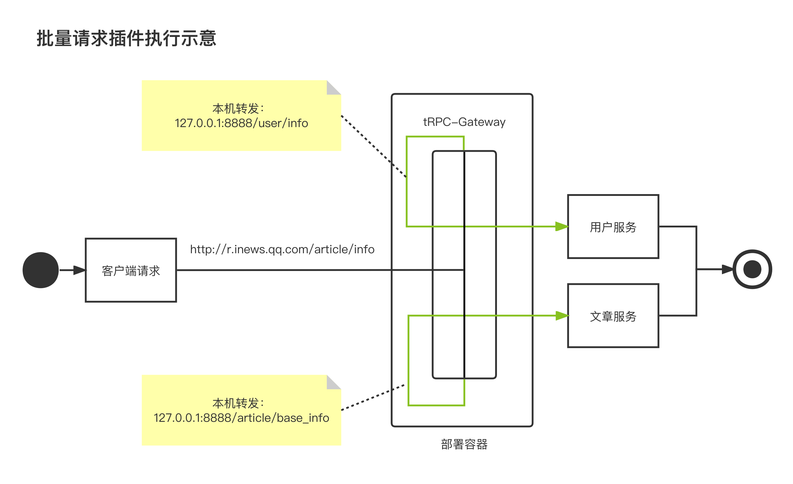
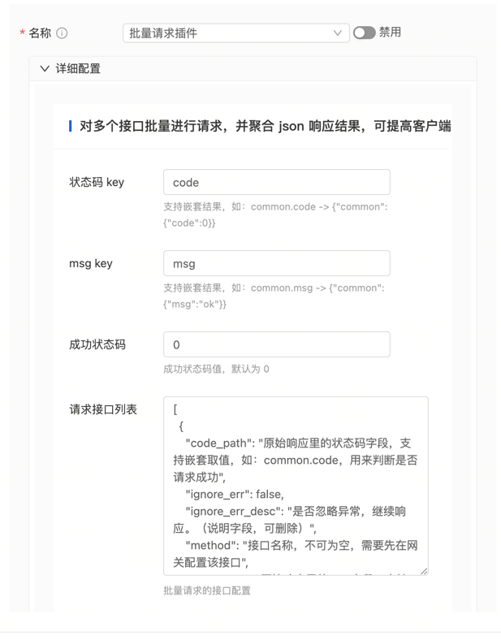

# Batch Request Plugin

Sometimes, clients (both APP and web) expect to combine two requests into one. For example, there are two interfaces:
user information interface and article information interface. The client would like to receive both contents in a single
request to speed up the page rendering process. The conventional approach is to create a new interface, but this simple
encapsulation increases development and maintenance costs, as there may be additional requirements to merge user
information with other information.

Here, a batch request capability is provided through a gateway plugin: multiple interfaces can be requested in a batch,
and the responses can be combined in a specified way before being returned to the client.

Please note the following limitations:

- There should be no dependencies between the interfaces. For example, using the response parameters of interface A as
  the request parameters of interface B would result in sequential requests.
- The request Content Type for multiple interfaces should be consistent. For example, if they are all URL encoded, as
  all request parameters will be passed to multiple interfaces.
- The response type must be application/json.

Recommendations for usage:

- Suitable for non-core scenario interfaces with low request volume:
    - We aim to strike a balance between development convenience and performance. Batch request processing involves
      parsing and assembling the response body, which may affect forwarding efficiency. It is not recommended to use
      this plugin for core scenarios with strict response time requirements.

## Technical Solution

Similar to the logreplay plugin, batch request is an edge feature that is implemented without affecting the core
forwarding logic.

The batch request functionality is implemented using native forwarding, which is a low-cost approach.



## Plugin Usage

### Import the plugin in the main.go file of the gateway project

- Add the import statement

```go
import (
    _ "trpc.group/trpc-go/trpc-gateway/plugin/batchrequest"
)
```

- tRPC framework configuration file, enable the batch_request interceptor.

Note: Make sure to register it in server.service.filter, not in server.filter.

```yaml
global:                             # Global configuration
server: # Server configuration
  filter:                                          # Interceptor list for all service handlers
  service: # Business services provided, can have multiple
    - name: trpc.inews.trpc.gateway                # Route name of the service
      filter:
        - batch_request                            # Gateway plugin registered in the service, so that it can be dynamically loaded in router.yaml
plugins: # Plugin configuration
  log:                                            # Log configuration
  gateway: # Plugin type is gateway
    scan_shield:                                  # Scan shield plugin
```

#### Configure the plugin in the gateway routing configuration file, router.yaml

```yaml
router: # Routing configuration
  - method: /v1/user/info
    id: "xxxxxx"
    target_service:
      - service: trpc.user.service
    plugins:
      - name: batch_request                      # Route-level plugin: Tencent authentication plugin
        props:
          code_path: code                         # Status code field name, default is code; supports nested structures, e.g., {"common":{"code":0}}, then fill in common.code
          msg_path: msg                           # msg field path, default is msg; supports nested structures, e.g., {"common":{"msg":"success"}}, then fill in common.msg
          success_code: 0                         # Success status code, default is 0
          request_list:
            - method: /v1/creation/user_ext_info   # Requested interface name
              code_path: code                      # Status code path in the original response, e.g., {"common":{"code":0}}, fill in common.code by default
              msg_path: msg                        # msg path in the original response, e.g., {"common":{"msg":"ok"}}, fill in common.msg by default
              source_date_path: data               # Target data path in the original response body, e.g., {"data":{"source":{}}}, write data.source
              target_data_path: data.users          # Path where the target data is inserted into the result response body, e.g., put it in {"data":{"target":{}}}, write data.target
              success_code: 0                      # Success status code in the original response, default is 0
              ignore_err: false                    # Whether to ignore errors, if true, continue requesting other interfaces if this interface request fails
            - code_path: code
              ignore_err: false
              method: /v1/creation/module_access
              msg_path: msg
              source_date_path: data
              success_code: 0
              target_data_path: data.modules

client: # Upstream service configuration, consistent with the tRPC protocol
  - name: trpc.user.service
    plugins:
      - name: batch_request                  # Service-level configuration
        props:
plugins:
  - name: batch_request                      # Global configuration
```

#### Configure the plugin using the console

