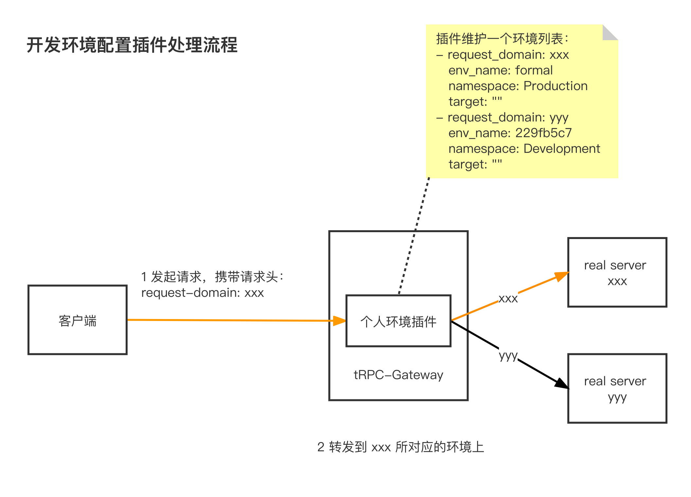
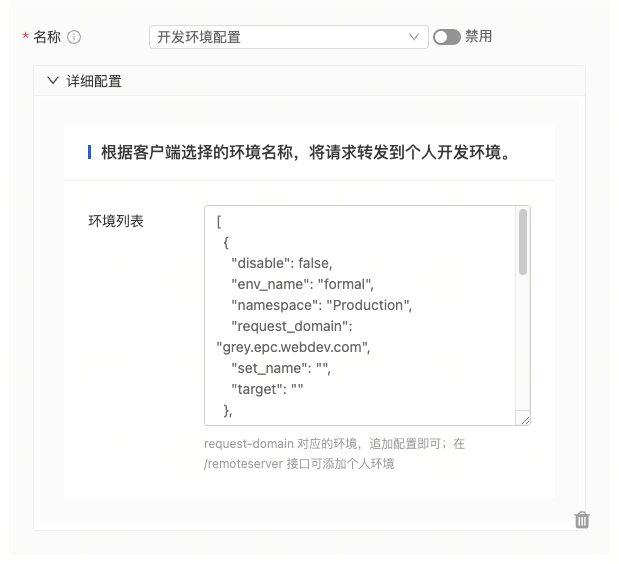

# Development Environment Configuration Plugin

To address the issue of multiple environments, this plugin can be configured to specify the target environment for forwarding based on the "request-domain" request header.

## Technical Solution


The plugin maintains a list of environment configurations, supporting all fields in the tRPC client, such as namespace, env_name, set_name, etc. The "disable_servicerouter" field is set to true.

## Plugin Usage

- This plugin is designed for offline environments and is not recommended for use in production as it may affect service stability.
- It can be used in conjunction with the [mocking](../mocking) plugin to provide an API for querying the environment list, allowing flexible environment switching on the client side.
- The response will include the "X-Proxy-Env" header for easy debugging.
  - Example value: target=polaris://trpc.inews.service&namespace=Development&env_name=f9283c03&set_name=

### Importing the Plugin in the Gateway Project's main.go

- Add the import statement

```go
import (
 _ "trpc.group/trpc-go/trpc-gateway/plugin/devenv"
)
```

- tRPC framework configuration file, enable the devenv interceptor.

Note: Make sure to register it under server.service.filter, not server.filter.

```yaml
global:                             # Global configuration
server:                             # Server configuration
  filter:                          # Interceptor list for all service handlers
  service:                          # Business services provided, can have multiple
    - name: trpc.inews.trpc.gateway      # Service routing name
      filter:
        - devenv # Gateway plugin registered under service.filter, so that it can be dynamically loaded in router.yaml
plugins:                            # Plugin configuration
  log:                              # Log configuration
  gateway:                          # Plugin type is gateway
    devenv:                         # Devenv plugin
      env_key: request-domain       # Request parameter name that identifies the environment, default is request-domain
```

#### Configuring the Plugin in the Gateway's router.yaml File

Plugins at different levels will only be executed once, with the priority order: router plugin > service plugin > global plugin

```yaml
router:                             # Router configuration
  - method: /v1/user/info
    id: "xxxxxx"
    target_service:
      - service: trpc.user.service
    plugins:
      - name: devenv                # Router-level plugin
        props:
          env_list:
            - request_domain: grey.epc.webdev.com   # Environment identifier
              disable: false                         # Whether to disable this environment
              namespace: Production
              env_name: formal                       # Environment name, same as env_name in trpc client
              target: "polaris://xxxx"               # Target service, same as target in trpc client
              set_name: ""                           # Set name, same as set_name in trpc client
client:                             # Upstream service configuration, follows the trpc protocol
  - name: trpc.user.service
    plugins:
      - name: devenv                # Service-level configuration
        props:
          - request_domain: grey.epc.webdev.com
            disable: false                         # Whether to disable this environment
            env_name: formal
            namespace: Production
            set_name: ""
            target: ""
plugins:
  - name: devenv                    # Global configuration
    props:
      - request_domain: grey.epc.webdev.com
        disable: false                         # Whether to disable this environment
        env_name: formal
        namespace: Production
        set_name: ""
        target: ""
```

#### Configuring the Plugin using the Console

