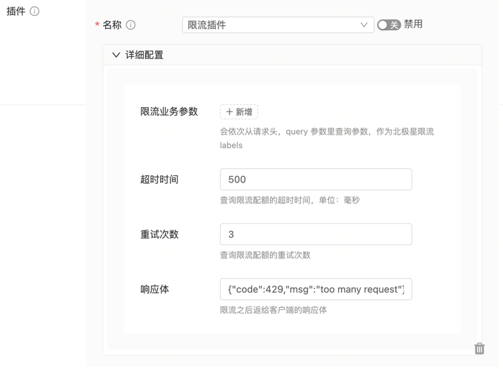

# tRPC-Gateway Polaris Distributed Rate Limiting Plugin

This plugin is a wrapper based on the [polaris limiter](https://github.com/polarismesh/polaris-go/tree/main/api) and is used to dynamically add rate limiting configurations to the gateway interfaces. For more information on Polaris rate limiting capabilities.

### Usage Instructions

### Add the corresponding rate limiting configurations in the Polaris console of the gateway service.

Please refer to the [ratelimit](https://github.com/polarismesh/polaris-go/blob/main/examples/ratelimit/README.md) for details.

### Import the plugin in the main.go file of the gateway project.

```go
import (
   _ "trpc.group/trpc-go/trpc-gateway/plugin/limiter/polaris"
)
```

- Configure the tRPC framework in the configuration file of the gateway project to enable the polaris_limiter interceptor.

Note: Make sure to register it in server.service.filter instead of server.filter.

```yaml
global:                             # Global configuration
server: # Server configuration
  filter:                                          # Interceptor list for all service handler functions
  service: # Business services provided, can have multiple
    - name: trpc.inews.trpc.gateway      # Route name of the service
      filter:
        - polaris_limiter # Gateway plugin registered in the service filter, so that it can be dynamically loaded in router.yaml
plugins: # Plugin configuration
  log:                                            # Log configuration
  gateway: # Plugin type is gateway
    polaris_limiter: # Polaris rate limiting plugin
      timeout: 500 # Default timeout for rate limiting quotas
      max_retries: 3 # Default maximum retries for rate limiting quotas
```

Configure the plugin in the router.yaml file of the gateway project. It supports global, service, and router-level plugin configurations.

```yaml
router: # Router configuration
  - method: /v1/user/info
    target_service:
      - service: trpc.user.service
    plugins:
      - name: polaris_limiter
        props:
          # Custom rate limiting labels that will be queried from request query parameters and cookies
          labels: [ "suid" ]
          # Response body after rate limiting, corresponding to HTTP status code 429
          limited_rsp_body: '{"code":429,"msg":"too many request"}'
          # Timeout for rate limiting quotas
          timeout: 500
          # Maximum number of retries for rate limiting quotas
          max_retries: 3
          # Rate limiting cluster namespace, default to the namespace of the gateway instance
          namespace: "Production"
          # Rate limiting service, default to the rate limiting configuration of the gateway instance
          service: "trpc.user.service"

client: # Upstream service configuration, consistent with the tRPC protocol
  - name: trpc.user.service
    plugins:
      - name: request_transformer # Service-level configuration, effective for interfaces forwarded to this service
        props:
plugins:
  - name: request_transformer # Global configuration, effective for all interfaces
    props:
```

## The plugin can also be used through the gateway console.

