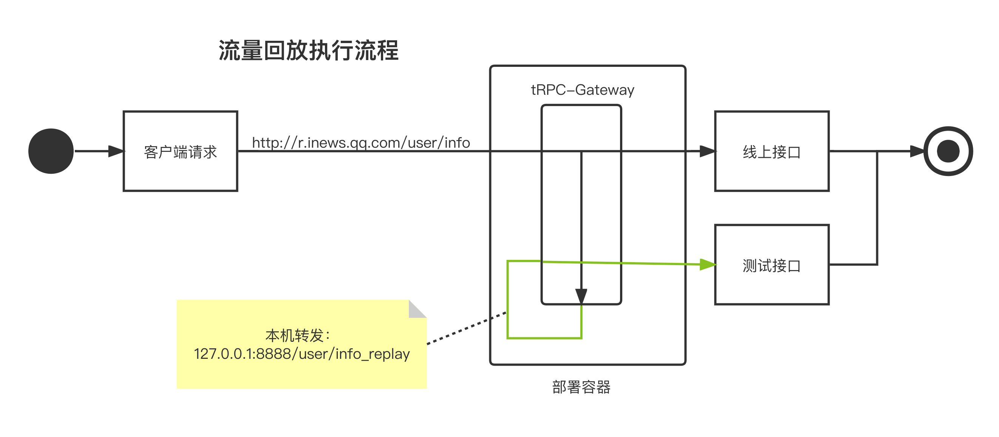

# Log Replay Plugin

For interface refactoring or modification, sometimes it is desired to validate using live requests.

One way is to integrate with a traffic replay platform for traffic replay, but it involves data storage and cost settlement issues.

The gateway provides a plugin for instant traffic forwarding, forwarding a certain proportion of live requests to the test interface.

## Use Cases:
- Interface refactoring or modification, using live traffic for validation
- Online debugging, forwarding live traffic
## Technical Solution

Traffic replay needs to be done after the main request is completed. The first thought is to implement it in the gateway forwarding logic.

However, following the principle of not invading core logic with edge functions, it will definitely not be implemented in the gateway forwarding logic (as it would be costly to implement). So we use local forwarding to implement traffic replay functionality at a low cost.

By default, it will be forwarded to the {original interface}_replay interface. Adding the _replay suffix distinguishes it from the original interface and facilitates management, indicating that it is a temporary interface.


[origin image](https://doc.weixin.qq.com/flowchart/f3_AfYA2QbtAOwrswIMitfQGK9I6iy7i?scode=AJEAIQdfAAo8Tk2ju9AfYA2QbtAOw)

## Usage

### Import the Plugin in the main.go file of the gateway project

- Add import
```go
import (
    _ "trpc.group/trpc-go/trpc-gateway/plugin/logreplay"
)
```

- tRPC framework configuration file, enable the logreplay interceptor.

Note: Be sure to register it in server.service.filter, not in server.filter.

```yaml
global:                             # Global configuration
server:                             # Server configuration
  filter:                          # Interceptor list for all service processing functions
  service:                         # Business services provided by the service, can have multiple
    - name: trpc.inews.trpc.gateway      # Route name of the service
      filter:
        - logreplay # Gateway plugin registered in the service filter, so that it can be dynamically loaded in router.yaml
plugins:                            # Plugin configuration
  log:                                            # Log configuration
  gateway:                          # Plugin type is gateway
    logreplay:                      # Log replay plugin
```

#### Configure the replay forwarding interface

After the original interface

#### In the gateway routing configuration file router.yaml, configure the replay forwarding interface and the logreplay plugin.

```yaml
router: # Routing configuration
  - method: /v1/user/info
    id: "xxxxxx"
    target_service:
      - service: trpc.user.service1
    plugins:
      - name: logreplay # Route-level plugin
  - method: /v1/user/info_replay # Configuration for replay forwarding interface
    id: "xxxxxx"
    target_service:
      - service: trpc.user.service2
    plugins:
client: # Upstream service configuration, consistent with trpc protocol
  - name: trpc.user.service
    plugins:
      - name: logreplay # Service-level configuration
        props:
          scale: # Replay ratio, e.g., 1% should be filled as 1
          # Whether to pass through the original response body.
          # POST request:
          #    Content-Type: application/json, then an origin_rsp_body field of type string will be added to the original JSON request body
          #    Content-Type: application/x-www-form-urlencoded, then a URL-encoded origin_rsp_body field will be added to the original query request body
          #    Other Content-Type: the original request will be appended to the query parameters, adding an origin_rsp_body field with the value of the URL-encoded response body
          # Other requests (GET, etc.):
          #    The original request will be appended to the query parameters, adding an origin_rsp_body field with the value of the URL-encoded response body
          pass_through_response: true
          # Timeout for replay requests, default is 500 milliseconds
          timeout: 500
plugins:
  - name: logreplay # Global configuration
```

#### The plugin can also be used through the gateway console.

