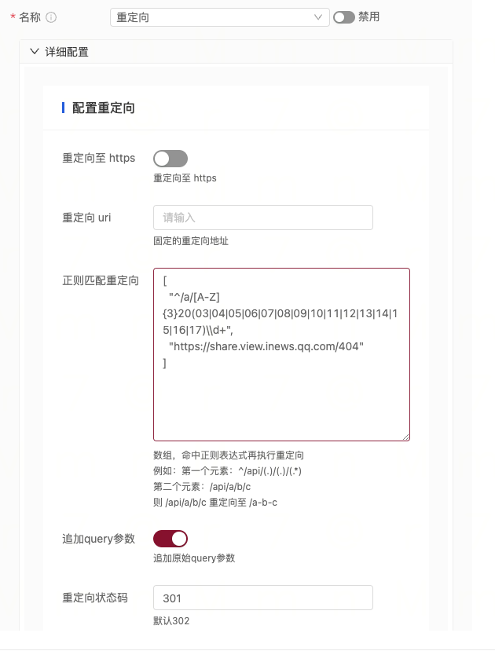

# Redirect Plugin

This plugin is used to configure redirection.

## Features

- Redirect to HTTPS
- Specify the redirection URI
- Configure redirection URI using regular expressions
- Specify the HTTP status code for redirection
- Support appending query parameters to the redirection URI

## Plugin Usage

### Import the Plugin in the Main.go File of the Gateway Project

- Add the import statement

```go
import (
    _ "trpc.group/trpc-go/trpc-gateway/plugin/redirect"
)
```

- Configure the tRPC framework file to enable the mocking interceptor.

Note: Make sure to register it in server.service.filter instead of server.filter.

```yaml
global:                             # Global configuration
server:                             # Server configuration
  filter:                                          # Interceptor list for all service handler functions
  service:                           # Business services provided, can have multiple
    - name: trpc.inews.trpc.gateway      # Route name for the service
      filter:
        - redirect # Register the gateway plugin in the service's filter so that it can be dynamically loaded in router.yaml
plugins:                            # Plugin configuration
  log:                                            # Log configuration
  gateway:                           # Plugin type is gateway
    redirect:                        # Redirect plugin
```

#### Configure the Plugin in the Router.yaml File of the Gateway Routing Configuration

Different level plugins are executed only once, with the priority order: Router plugin > Service plugin > Global plugin.

```yaml
router:
  - method: /v1/user/info
    id: "xxxxxx"
    target_service:
      - service: trpc.user.service
    plugins:
      - name: redirect # Router-level plugin
        props:  # Note: Only one of uri, http_to_https, regex_uri can be filled
          uri: "" # Redirection URI
          http_to_https: false
          regex_uri: # Redirect based on regular expression match
            - ^/api/(.)/(.)/(.*) # Regular expression, e.g., /api/a/b/c
            - /$1-$2-$3 # Redirection URI, cannot be empty. This example redirects to /a-b-c
          append_query_string: true # Whether to append original query parameters to the redirection URI
          ret_code: 302 # Redirection status code, default is 302
```

#### Configure the Plugin Using the Console



