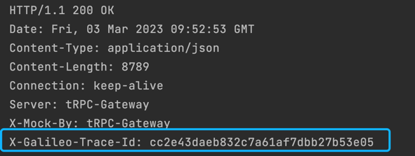

# TraceID Setting Plugin

Returning the trace ID of the call chain during interface debugging can improve problem troubleshooting efficiency.

- It can be used as a tRPC-Go filter by configuring it in trpc_go.yaml.
- It can also be used as a gateway plugin, configured to be effective at the interface level.



Note: Only sampled requests will return the trace ID.

## Usage

### Import the Plugin in the main.go of the Gateway Project

- Add the import statement:

```go
import (
    _ "trpc.group/trpc-go/trpc-gateway/plugin/traceid"
)
```

- Configure the tRPC framework in the configuration file to enable the trace ID interceptor.

Note: Make sure to register it in server.service.filter, not server.filter.

```yaml
global:                             # Global configuration
server:                             # Server configuration
  filter:                          # Interceptor list for all service handler functions
  service:                          # Business services provided, can have multiple
    - name: trpc.inews.trpc.gateway      # Route name of the service
      filter:
        - traceid # Gateway plugin registered in the service filter, so that it can be dynamically loaded in router.yaml
plugins:                            # Plugin configuration
  log:                              # Log configuration
  gateway:                          # Plugin type is gateway
    traceid:                        # TraceID plugin
```

#### Configure the Plugin in the Gateway Router Configuration router.yaml File

```yaml
router:                             # Router configuration
  - method: /v1/user/info
    id: "xxxxxx"
    target_service:
      - service: trpc.user.service
    plugins:
      - name: traceid                # Route-level plugin
client:                             # Upstream service configuration, consistent with the tRPC protocol
  - name: trpc.user.service
    plugins:
      - name: traceid                # Service-level configuration
        props:
plugins:
  - name: traceid                    # Global configuration
```