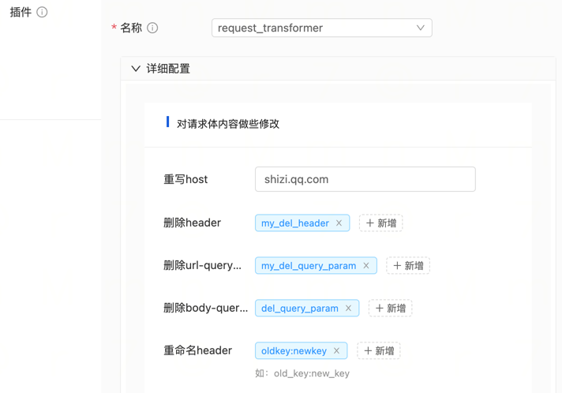

# tRPC-Gateway Request Transformation Plugin

The request transformation plugin allows for modifying the HTTP request headers and parameters during request forwarding. It eliminates the need for manual interface encapsulation work and improves efficiency.

## Usage Instructions

### Import the Plugin in the main.go file of the Gateway Project

- Add the import statement

```go
import (
_ "trpc.group/trpc-go/trpc-gateway/plugin/transformer/request"
)
```

- Configure the tRPC framework in the configuration file to enable the request transformer interceptor.

Note: Make sure to register it under server.service.filter and not server.filter.

```yaml
global:                             # Global configuration
server:                             # Server configuration
  filter:                                          # Interceptor list for all service handler functions
  service:                            # Business services provided, can have multiple
    - name: trpc.inews.trpc.gateway      # Route name for the service
      filter:
        - request_transformer # Gateway plugin registered in the service's filter, so that it can be dynamically loaded in router.yaml
plugins:                            # Plugin configuration
  log:                                            # Log configuration
  gateway:                            # Plugin type is gateway
    request_transformer:  # Name of the request transformer plugin
```

Configure the plugin in the gateway router configuration file (router.yaml). It supports global, service, and router-level plugin configurations.

```yaml
router: # Router configuration
  - method: /v1/user/info
    target_service:
      - service: trpc.user.service
    plugins:
      - name: request_transformer
        props:
          add_headers: # Add request headers
            - key: val
          add_body: # Add request body parameters
            - key: val
            # support for specified types:number、string、bool
            - key_bool:true:bool
            - key_num:1:number
            - key_str:hi:string
          add_query_str: # Add URL query parameters
            - key: val
          reserve_headers: # Only keep specified request headers, higher priority than remove_headers, -1 means remove all
            - -1
          remove_headers: # Remove request headers
            - my_del_header
          reserve_body: # Only keep specified body parameters, higher priority than remove_body, -1 means remove all. Multipart form does not support this operation.
            - -1
          remove_body: # Remove request body parameters
            - del_query_param
          reserve_query_str: # Only keep specified query string parameters, higher priority than remove_query_str, -1 means remove all
            - -1
          remove_query_str: # Remove URL query parameters
            - my_del_query_param
          rename_headers: # Rename request headers, renamed headers will not be formatted
            - oldkey: newkey
          rename_body: # Rename request body parameters
            - oldkey: newkey
          rename_query_str: # Rename URL query parameters
            - oldkey: newkey
          rewrite_host: shizi.qq.com # Modify host
client: # Upstream service configuration, follows the trpc protocol
  - name: trpc.user.service
    plugins:
      - name: request_transformer # Service-level configuration, will be effective for all interfaces forwarded to this service
        props:
plugins:
  - name: request_transformer # Global configuration, will be effective for all interfaces
    props:
```

## The plugin can also be used through the gateway console.
