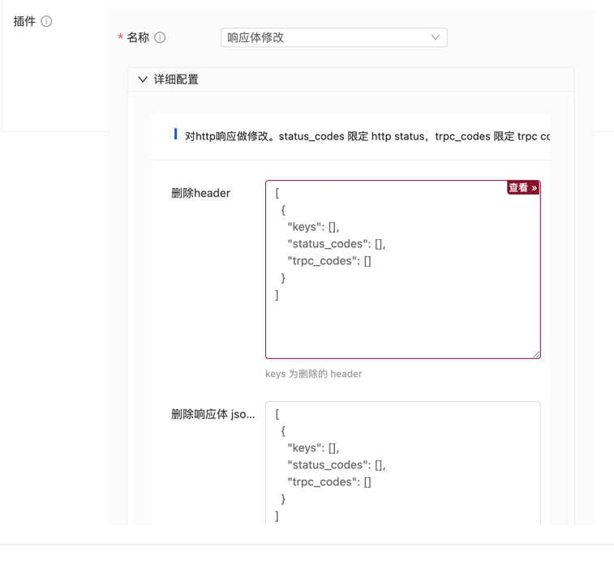

# Response Transformation Plugin

When forwarding requests, the response headers and parameters of the HTTP response can be modified, added, or deleted
through plugins. This can avoid the inefficient work of wrapping interfaces.

Note the performance impact when modifying the response body, as it requires parsing and then filling it back.

## Usage Instructions

### Import the Plugin in the main.go file of the Gateway Project

- Add the import statement

```go
import (
_ "trpc.group/trpc-go/trpc-gateway/plugin/transformer/response"
)
```

- Configure the tRPC framework in the configuration file to enable the response transformer interceptor.

Note: Make sure to register it in server.service.filter and not in server.filter.

```yaml
global:                             # Global configuration
server: # Server configuration
  filter:                          # Interceptor list for all service handler functions
  service: # Business services provided, can have multiple
    - name: trpc.inews.trpc.gateway      # Route name of the service
      filter:
        - response_transformer # Register the gateway plugin in the service filter so that it can be dynamically loaded in router.yaml
plugins: # Plugin configuration
  log:                              # Log configuration
  gateway: # Plugin type is gateway
    request_transformer:           # Cross-origin plugin name
```

Configure the plugin in the gateway routing configuration file router.yaml. It also supports global, service, and
router-level plugin configurations.

```yaml
router: # Router configuration
  - method: /v1/user/info
    target_service:
      - service: trpc.user.service
    plugins:
      - name: response_transformer
        props:
          # Remove headers
          remove_headers:
            - keys:
                # Headers to remove
                - header_to_remove
              status_codes:
                # Limit by HTTP status code
                - 401
              trpc_codes:
                # Limit by tRPC code
                - 5000
          # Remove JSON keys
          remove_json:
            - keys:
                # Supports multi-level removal, e.g., common.suid
                - json_key_to_remove
              status_codes:
                - 401
              trpc_codes:
                - 5000
          # Rename headers (renamed headers will not be formatted)
          rename_headers:
            - keys:
                # Rename header
                - old_name:new_name
              status_codes:
                - 401
              trpc_codes:
                - 5000
          # Rename JSON keys
          rename_json:
            - keys:
                # Supports hierarchical operations, e.g., common.suid:common.suidv2
                - old_key:new_key
              status_codes:
                - 401
              trpc_codes:
                - 5000
          # Add headers
          add_headers:
            - keys:
                - header_key:val
              status_codes:
                - 401
              trpc_codes:
                - 5000
          # Add JSON keys
          add_json:
            - keys:
                # Supports hierarchical operations, supports specifying types, e.g., number, string, bool
                - key:true:bool
              status_codes:
                - 401
              trpc_codes:
                - 5000
          # Replace headers
          replace_headers:
            - keys:
                # Replace if exists, skip if not
                - new_key:val
              status_codes:
                - 401
              trpc_codes:
                - 5000
          # Replace JSON keys
          replace_json:
            - keys:
                # Supports hierarchical operations, supports specifying types
                - key:123:number
              status_codes:
                - 401
              trpc_codes:
                - 5000
          # Append headers
          append_headers:
            - keys:
                # Append if exists, skip if not
                - k:v
              status_codes:
                - 401
              trpc_codes:
                - 5000
          # Append JSON keys
          append_json:
            - keys:
                # Append if exists, skip if not; supports hierarchical operations, supports specifying types
                - k:v:string
              status_codes:
                - 401
              trpc_codes:
                - 5000
          # Replace JSON body
          replace_body:
            - keys:
                # Replace JSON body
                - '{"code":401}'
              status_codes:
                - 401
              trpc_codes:
                - 5000
          # Limit the returned keys
          allow_json:
            - keys:
                # Supports hierarchical operations
                - code
                - msg
                - data
              status_codes:
                - 401
              trpc_codes:
                - 5000
client: # Upstream service configuration, consistent with the tRPC protocol
  - name: trpc.user.service
    plugins:
      - name: request_transformer # Service-level configuration, will take effect for all interfaces forwarded to this service
        props:
plugins:
  - name: request_transformer # Global configuration, will take effect for all interfaces
    props:
```

## Console Usage

This plugin can also be used through the Gateway Console.
